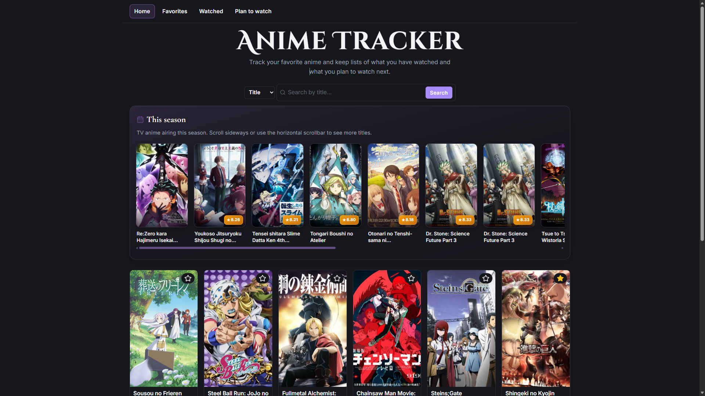

# Anime Tracker

A web application built with React, TypeScript, and Vite to search anime, view details, and manage personal lists such as favorites, watched, and planned.

## Preview



## Features

- Featured anime list
- Search by title
- Search by studio
- Search by year
- Paginated results
- Anime details page
- Favorites list
- Watched list
- Planned list
- Local persistence with `localStorage`
- Loading skeleton states
- Request error handling

## Tech Stack

- React
- TypeScript
- Vite
- React Router
- Context API
- CSS
- Jikan API

## Project Goal

This project was built to practice modern front-end concepts such as component-based architecture, TypeScript typing, external API integration, state management, and code organization in a realistic beginner-level application.

## What I Practiced

While building this project, I worked on:

- consuming a REST API with error handling
- building reusable UI components with React
- managing shared state with Context API
- persisting user data in the browser with `localStorage`
- organizing code by pages, components, hooks, context, and types
- improving UX with loading feedback and empty states

## Project Structure

```text
src/
  components/
  config/
  context/
  hooks/
  layout/
  lib/
  pages/
  types/

##Running Locally

npm install
npm run dev

##To build for production:
npm run build

##To run type checking:
npm run typecheck

##To run lint:
npm run lint

##API Utilizada
Este projeto utiliza a Jikan API, uma API pública baseada em MyAnimeList.

Autor
Kauai Oliveira Braga